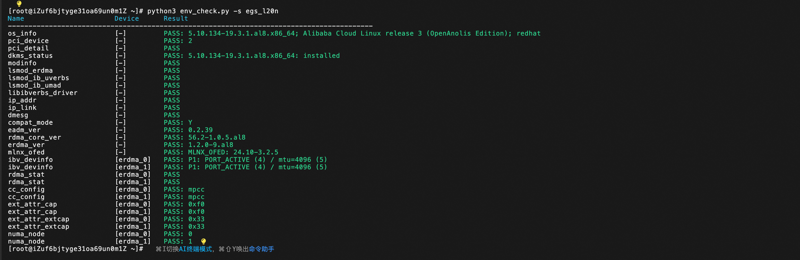
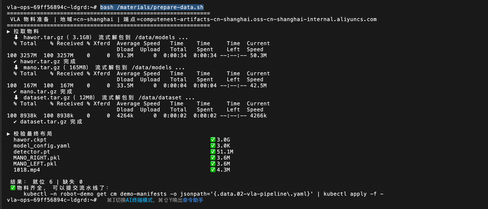
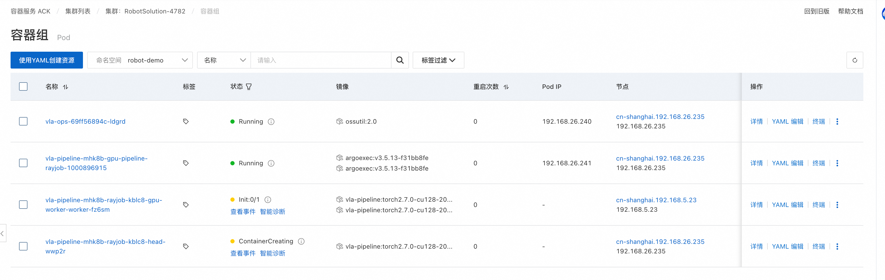
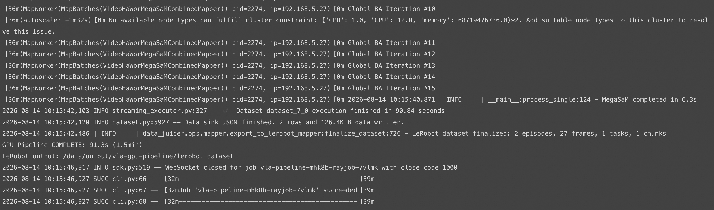
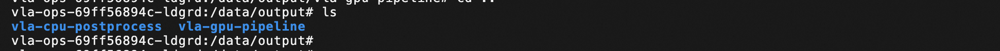

# 机器人（VLA）数据处理解决方案 · 使用文档

> 本服务基于阿里云 ROS 模板一键交付一套「具身智能数据加工」环境：ACK 托管 Pro 集群 + L20N eRDMA GPU 节点池 + OSS/NAS 存储 + Argo Workflows + KubeRay + Fluid，并内置 data-juicer VLA 流水线 Demo（第一人称手部视频 → LeRobot v2.0 训练数据集）。

---

## 一、服务部署了什么

### 1.1 集群与组件清单

| 类别 | 组件 | 版本 / 说明 | 安装方式 |
|---|---|---|---|
| 集群 | ACK 托管 Pro | `ack.pro.small`，Terway-ENIIP，ProxyMode `ipvs`，公网 API 入口开启 | `ALIYUN::CS::ManagedKubernetesCluster` |
| Ray | kuberay-operator | ACK 托管组件（**operator 跑在管控面，集群内看不到 Deployment**，就绪信号看 `rayjobs.ray.io` CRD） | `ALIYUN::CS::ClusterAddons` |
| eRDMA | ack-erdma-controller | Config：`preferDriver=ofed`、`allocateAllDevices=true` | `ALIYUN::CS::ClusterAddons` |
| 工作流 | ack-workflow（Argo Workflows） | **3.5.15**，镜像走 ACK 地域 VPC 仓库 | `ALIYUN::CS::ClusterAddons` |
| 数据加速 | ack-fluid | 通过 `MODULE::ACS::ComputeNest::FluxOciHelmDeploy` 安装到 `fluid-system`，values 传 `region` + `pullImageByVPCNetwork=true`（必须用 ACK 版 chart，社区版含 Helm `lookup` 会解析失败） | Helm(OCI) |
| GPU 驱动 | NVIDIA **580.126.09** | 由节点标签 `ack.aliyun.com/nvidia-driver-version` 固定（L20N + eRDMA 官方要求） | 节点池标签 |
| eRDMA 驱动 | erdma_installer **1.5.9** | 节点 UserData 从 `mirrors.cloud.aliyuncs.com/erdma` 升级；≥1.5.9 默认启用 MPCC 拥塞算法 | 节点 UserData |

### 1.2 两个节点池

| 节点池 | 名称 | 规格 | 盘 | 标签 / 污点 | 用途 |
|---|---|---|---|---|---|
| 管控 | `sys-pool` | `ecs.u1-c1m4.xlarge`（默认，4C16G，可选 4 种 u1）×≥2，跨主/次可用区打散 | 系统盘 200G ESSD | `robot-solution.aliyun.com/node-role=system` | 承载 Argo / KubeRay / Fluid / CSI，**不跑 GPU 负载** |
| GPU | `gpu-pool` | `ecs.ebmgn9g.64xlarge`（默认，256C/2304G/**8×L20N 48G**），另可选 `ebmgn9gc.64xlarge`、`ebmgn9ge.64xlarge`；数量 0~16，默认 1，**全部落主可用区** | 系统盘 500G ESSD | 标签 `robot-solution.aliyun.com/node-role=gpu`；污点 `nvidia.com/gpu=true:NoSchedule` | eRDMA + GPU 算力，Demo 与流水线跑在这里 |

> ⚠️ **L20N 裸金属当前全地域售罄、弹性配额默认为 0**，部署前必须先申请 L20N 配额/白名单，否则栈会以 `InstanceTypeNoStock` 或 `QuotaExceed` 失败。

### 1.3 创建的云资源与集群内对象

**云资源（VPC/存储/RAM）**

| 资源 | 说明 |
|---|---|
| VPC + 2 台交换机 | 选「新建专有网络」时由 `MODULE::ACS::ComputeNest::VpcAndVSwitch` 创建（默认 VPC `192.168.0.0/16`，主/次交换机 `192.168.0.0/20`、`192.168.16.0/20`）；选「已有」则复用你填的 ID。交换机同时承载节点与 Terway Pod IP，**建议 /20 及以上** |
| OSS Bucket | **作用：输入层**——`dataset/` 存源视频、`models/` 存模型权重，分别以 `robot-dataset`、`robot-models` 两个 PVC 挂进运维控制台与流水线 Pod 的 `/data/dataset`、`/data/models`（ossfs，适合大文件顺序读；备料时也靠它写入 3.1GB 级的权重）。<br>选「新建Bucket」时自动创建 `robot-data-<StackId 前 8 位>`（private / LRS / Standard，`DeletionForce: true`）；并预建 `dataset/` 与 `models/` 两个前缀（ossfs 挂子目录时目录不存在会挂载失败） |
| RAM 用户 + AccessKey | **作用**：供 CSI 挂载 OSS 与备料脚本访问 Bucket，以 Secret `oss-secret` 形式存在 `robot-demo` 命名空间。选「自动创建 AccessKey」时创建，权限**仅限该 Bucket** 的 `oss:*`；也可改为自备 AK（模板会展示所需策略 JSON） |
| NAS 文件系统 + 挂载点 | **作用：输出层**——以 `robot-output` PVC 挂到 `/data/output`，存流水线中间结果（`frames/`、`moge_arrays/`、`megasam_arrays/`、`*.json`、`lerobot_dataset/`）与最终数据集 `lerobot_dataset_smoothed/`。**这里必须用 NAS 而不是 OSS**：这一段是频繁写小文件，ossfs 的写性能与 POSIX 语义不足；同时需 RWX 供 Ray head/worker/后处理 Pod 跨节点共挂。<br>通用型 NFS、按量付费，`Performance`/`Capacity` 二选一；挂载点落 VPC 主交换机（**不指定 ZoneId**，由 NAS 自选支持的可用区，避免 `InvaildZone.NotExist`）。单价约为 OSS 的 3 倍，产物建议归档回 OSS 后清理 |

### 1.4 部署输出（Outputs）

| 输出项 | 内容 |
|---|---|
| `ClusterId` / `ClusterConsoleUrl` | ACK 集群 ID 与控制台地址 |
| `OssBucketName` | 本实例使用的 Bucket |
| `Step1PrepareMaterials` | 备料命令（见 3.1） |
| `OssBucketForYourOwnData` | 上传自有视频的 `aliyun oss cp` 命令 |
| `Step2SubmitDemoB` | VLA 流水线的提交命令（见 3.2） |

---

## 二、eRDMA 校验方式

登录 GPU 节点池下的任一 GPU 节点，拉取并执行官方体检脚本：

```bash
wget http://mirrors.cloud.aliyuncs.com/erdma/tools/env_check.py
python3 env_check.py -s egs_l20n
```

校验项全部为 **PASS** 即说明 eRDMA 已安装并配置正常。



## 三、data-juicer 示例（VLA 流水线）

### 3.0 Demo 概览

命名空间 `robot-demo` 下有一个名为 `vla-ops` 的 Deployment（运维控制台），本示例的备料与提交操作都在它里完成。

### 3.1 第 1 步：备料

物料均来自计算巢公开制品库，**无需自备**：

| 包 | 大小 | 解压根目录 | 内容 |
|---|---|---|---|
| `hawor.tar.gz` | 3.1 GB | `/data/models` | HaWoR 权重 / 配置 / 检测器 |
| `mano.tar.gz` | 165 MB | `/data/models` | MANO 左右手模型 |
| `dataset.tar.gz` | 12 MB | `/data/dataset` | 两段测试视频 |

在 `vla-ops` 容器内执行下面的命令完成上述物料的下载与校验：

```bash
bash /materials/prepare-data.sh
```



### 3.2 第 2 步：提交两阶段流水线

同样在 `vla-ops` 容器内提交流水线：

```bash
kubectl create -f /demo-manifests/02-vla-argo-workflow.yaml
```

提交后可以看到 RayJob 以及 Ray head / Ray worker 已被创建出来，等待其进入运行状态即可。



流水线日志从 submitter Pod（形如 `vla-pipeline-mhk8b-rayjob-j6jgp`）中查看：

```bash
kubectl -n robot-demo logs -f <workflow-name>-rayjob-xxxxx
```



待所有 Pod 均变为 `Completed` 状态后，回到 `vla-ops` 容器内即可查看产出结果：



### 3.3 小结

`vla-ops` 容器内挂载的关键目录如下：

| 路径 | 作用 |
|---|---|
| `/data/models` | 模型权重（HaWoR、MANO） |
| `/data/dataset` | 输入视频 |
| `/data/output` | 流水线产物 |
| `/demo-manifests/02-vla-argo-workflow.yaml` | 提交用的流水线 YAML |
| `/scripts` | 流水线调用的 Python 脚本 |

想换成自己的视频，只需替换 `/data/dataset` 下的视频文件；想调整处理逻辑，修改流水线 YAML 与 `/scripts` 下的 Python 脚本即可。